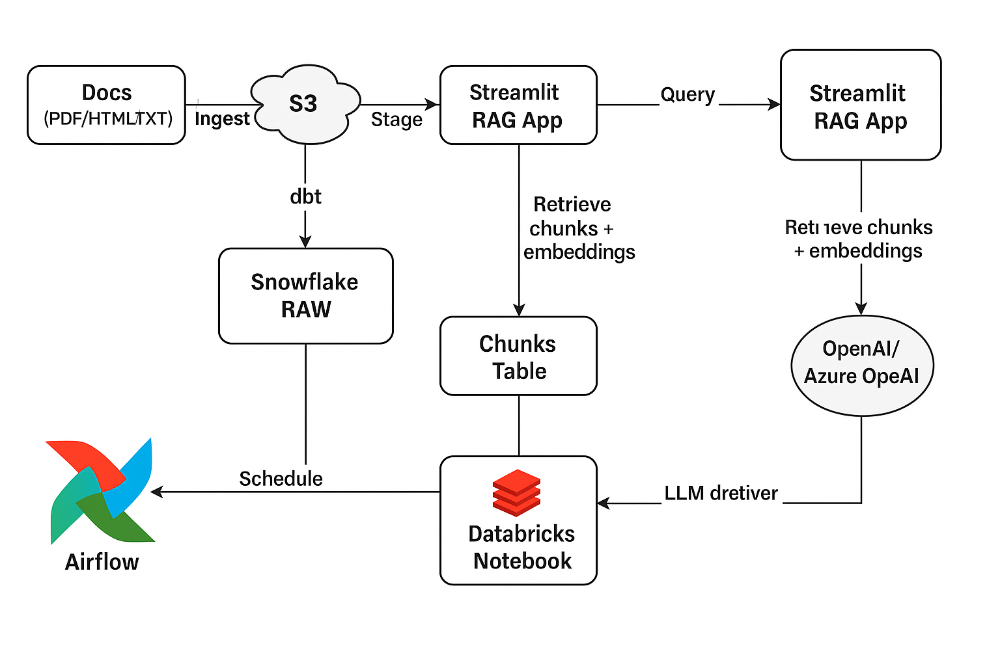
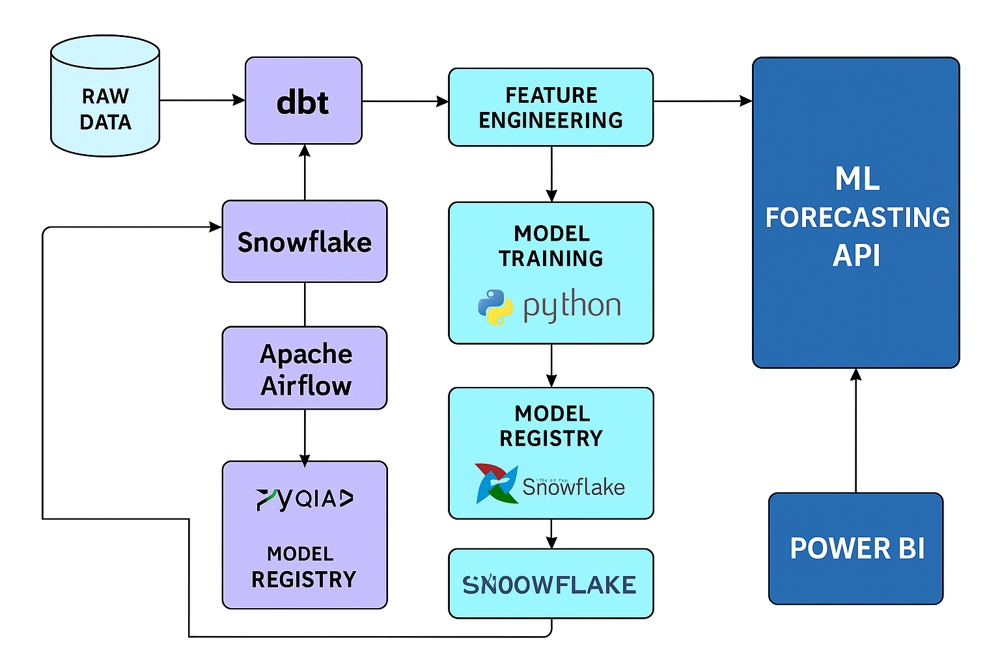

<p align="left">
  
  
  
  
  
  
  
</p>
# Portfolio AI Projects

This repo contains two end-to-end **personal** projects demonstrating AI/ML + the modern data stack.

## Projects
- **rag-copilot/** — Retrieval-Augmented Generation (RAG) assistant over public documents using Snowflake + dbt + Airflow + Databricks + Streamlit.
- ### RAG Copilot — Screenshots


flowchart LR
  A[Docs (PDF/HTML/TXT)] -->|Ingest| S3[(S3)]
  S3 -->|Stage| SNF[Snowflake RAW]
  SNF -->|dbt| Dbt[dbt models: staging→intermediate→marts]
  Dbt --> CH[Chunks Table]
  CH -->|Embed| DBX[Databricks Notebook]
  DBX --> EMB[Embeddings in Snowflake]
  UI[Streamlit RAG App] -->|Query| SNF
  UI -->|Retrieve chunks + embeddings| EMB
  UI -->|LLM call| LLM[(OpenAI/Azure OpenAI)]
  AF[Airflow] -->|Schedule| S3
  AF --> Dbt
  AF --> DBX
  ## 📚 RAG Knowledge Assistant (Personal Project)
**Stack:** Snowflake, dbt, Airflow, Databricks, OpenAI, Streamlit  
**What it does:** Natural-language search with citations over 500+ public policy/compliance docs.  
**Highlights:** 85% retrieval accuracy on a labeled QA set; sub-2s response time; dbt tests for freshness & keys.

- End-to-end pipeline: ingestion → chunking → embeddings → retrieval → LLM answer
- Airflow DAG manages daily refresh and data tests
- Streamlit UI with source citations and answer confidence


---

## 📈 ML Demand Forecasting & Auto-Insights (Personal Project)
**Stack:** Snowflake, dbt, Airflow, Databricks (XGBoost/Prophet), Power BI, SHAP  
**What it does:** Forecasts daily demand and generates driver insights for planners.  
**Highlights:** Backtest MAPE ≤ 8%; SHAP drivers surfaced in Power BI; hourly freshness.

- dbt feature store (lags, rolling means, weather joins)
- Airflow schedules train/score; predictions written back to Snowflake
- Power BI dashboard shows forecasts, error bands, and drivers



- **ml-forecasting/** — Time-series demand forecasting with SHAP-based insights using Snowflake + dbt + Airflow + Databricks + Power BI.
- ### ML Forecasting — Screenshots


flowchart LR
  RAW1[Demand CSV] --> SNF[Snowflake RAW]
  RAW2[Weather API/CSV] --> SNF
  RAW3[Calendar/Holidays] --> SNF
  SNF -->|dbt| Dbt[dbt models: dims, fcts, features]
  Dbt --> FEAT[Feature Table]
  FEAT -->|Train/Score| DBX[Databricks (XGBoost/Prophet)]
  DBX --> PRED[ml.forecasts in Snowflake]
  BI[Power BI] -->|DirectQuery/Import| PRED
  AF[Airflow] -->|Orchestrate| Dbt
  AF --> DBX
  ## 📈 ML Demand Forecasting & Auto-Insights (Personal Project)
**Stack:** Snowflake, dbt, Airflow, Databricks (XGBoost/Prophet), Power BI, SHAP  
**What it does:** Forecasts daily demand and generates driver insights for planners.  
**Highlights:** Backtest MAPE ≤ 8%; SHAP drivers surfaced in Power BI; hourly freshness.

- dbt feature store (lags, rolling means, weather joins)
- Airflow schedules train/score; predictions written back to Snowflake
- Power BI dashboard shows forecasts, error bands, and drivers


> **Note:** All code is templated for personal use: no company code/data. Replace placeholders with your credentials and dataset paths.

---

## Quickstart

### 1) Clone & set up
```bash
git clone <YOUR_REPO_URL>.git
cd portfolio-ai-projects
python3 -m venv .venv && source .venv/bin/activate
pip install -r requirements.txt
```

### 2) Environment variables (create `.env` in project root)
```
SNOWFLAKE_ACCOUNT=<acct>
SNOWFLAKE_USER=<user>
SNOWFLAKE_PASSWORD=<password>
SNOWFLAKE_ROLE=<role>
SNOWFLAKE_WAREHOUSE=<warehouse>
SNOWFLAKE_DATABASE=<database>
SNOWFLAKE_SCHEMA=<schema>
OPENAI_API_KEY=<key>
```

### 3) Airflow (local, via Docker) – optional
Use `airflow/` in each project for example DAGs. Replace connections in the DAGs or use Airflow UI to set them.

### 4) dbt
Inside each project's `dbt/` folder:
```bash
cd <project>/dbt
pip install -r requirements.txt
dbt debug
dbt run
dbt test
```

### 5) Databricks
Import notebooks from `databricks/` into Community Edition or link via repo integration.

### 6) Apps/Dashboards
- `rag-copilot/app/` — Streamlit app: `streamlit run app.py`
- `ml-forecasting/powerbi/` — Open the PBIX template and point to Snowflake.

---

## Pushing to GitHub
```bash
git init
git add .
git commit -m "Initial commit: RAG + Forecasting portfolio projects"
git branch -M main
git remote add origin https://github.com/<your-username>/portfolio-ai-projects.git
git push -u origin main
```

## License
MIT — see `LICENSE`.

